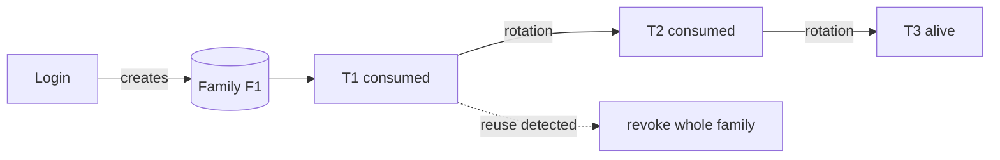
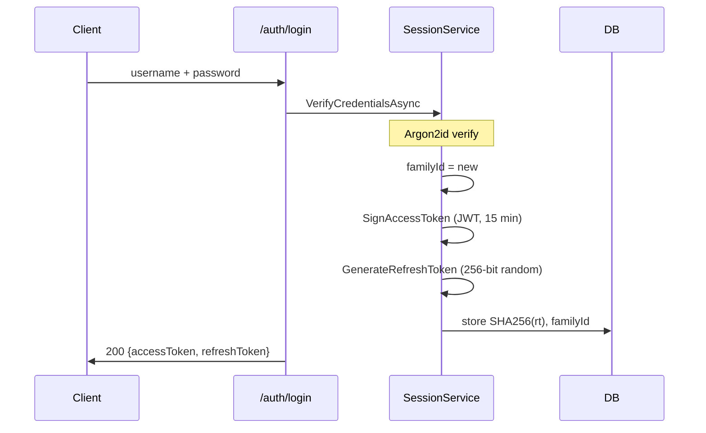
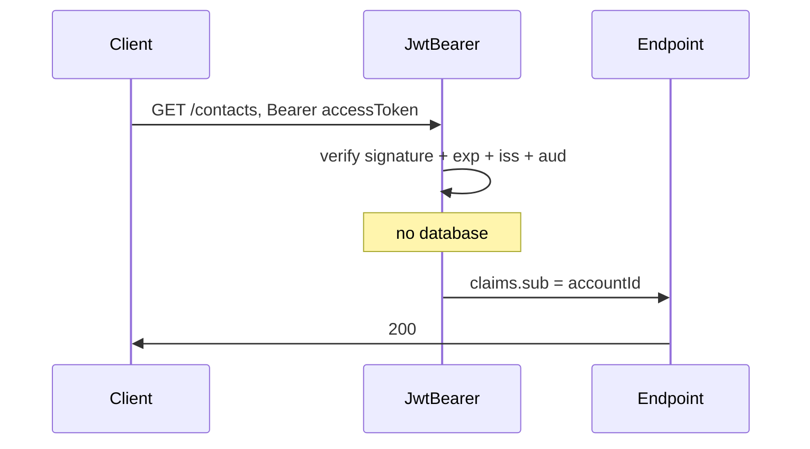
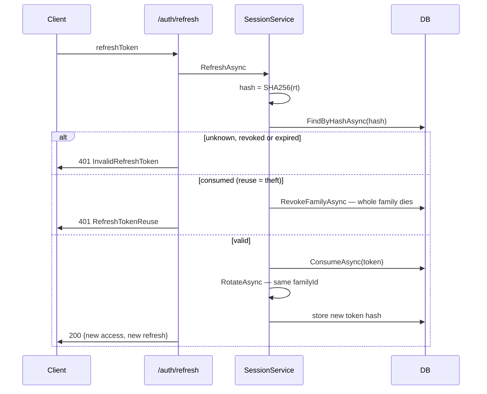
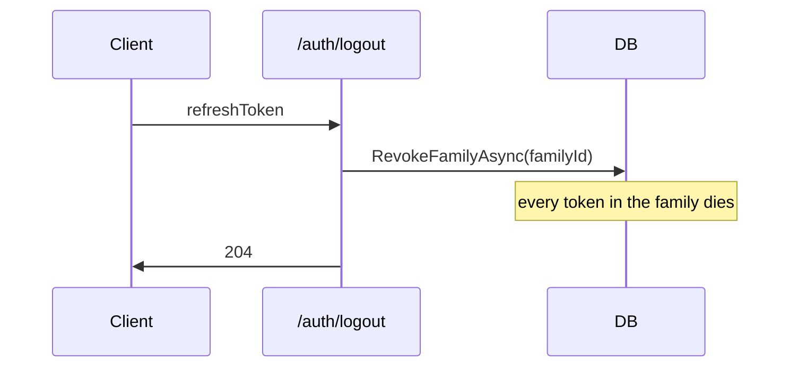
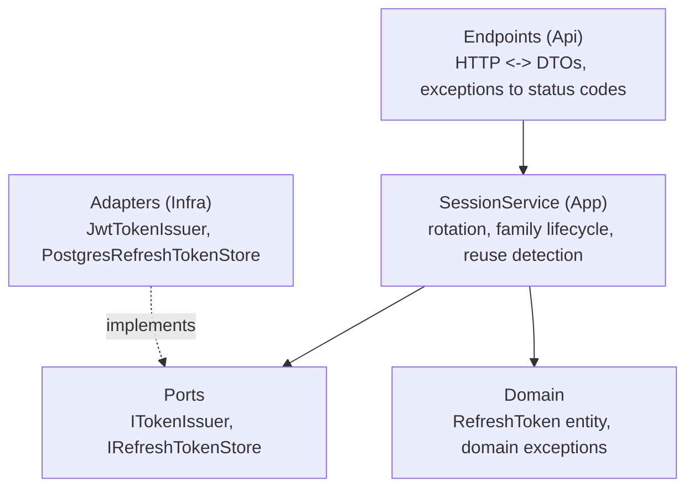

# Account session flow — JWT + refresh token rotation

Explains how account sessions work mechanically, per the session strategy in
ADR 0007. This document is the reader's guide to the code; the ADR is the
decision record.

## Why two tokens

Account auth separates two concerns:

- **Access** — short-lived JWT (~15 min), account scope. Stateless: the
  server validates the signature without touching the database. Used on
  every social endpoint request.
- **Permanence** — opaque refresh token (~30 days), stateful. The server
  looks it up in the database on every use, so it can be consumed, rotated,
  and revoked. Used only on the refresh endpoint.

Without this split, the alternatives are both bad: a 15-minute JWT alone
forces a password prompt every quarter hour; a 30-day JWT alone cannot be
revoked — a stolen copy rides until expiry.

## Why the refresh token is opaque, not JWT

Revocation and rotation require server-side state — the database must know
whether a token was consumed or revoked. If the server must consult the
database anyway, a signed JWT adds a signature that is never used. An
opaque 256-bit random string is simpler and safer:

- No readable metadata — a decoded JWT exposes subject and expiry; an
  opaque string reveals nothing.
- No signing material to maintain or rotate.
- Unguessable and unforgeable — the only valid value is the one the server
  issued.

Rule of thumb: JWT when stateless validation is wanted; opaque when
revocability is needed. Access token does not need revocation (expires in
15 minutes) so it is a JWT; refresh token must be revocable (rotation,
reuse detection, logout) so it is opaque.

## Why the refresh token is stored hashed

The database stores the SHA-256 hash of the token, never the token itself.
A database leak then exposes only hashes — unusable for refresh requests.
The server does not decrypt the stored value; it hashes the incoming token
and compares hashes. SHA-256 is deterministic: same input, same output.

SHA-256 (not Argon2id) because the input is already 256 bits of
cryptographic randomness — there is no dictionary to defend against. The
hash exists only to survive a database leak.

## Rotation and families

Every refresh use consumes the presented token and issues a new one inside
the same family. A family is all tokens descended from one login:

Revocation granularity is the family, not the token. If a consumed token is
presented again, the whole family is revoked — not just that token — because
the presenter might hold several tokens from the same lineage. The family is
the trust boundary: if any token in it shows reuse, no token in it is
trustworthy ever again.

## Theft detection semantics

Whoever presents a token first wins the next pair; the other party's attempt
presents a consumed token, which kills the family:

- Attacker refreshes first → attacker gets the new pair → user's next refresh
  presents a consumed token → reuse detected → family revoked → attacker loses
  the session too.
- User refreshes first → user continues → attacker's reuse → family revoked.

The attacker's only temporary win is refreshing while the user never comes
back. As soon as the user returns, the family dies. This is fail-closed:
when in doubt, nobody stays in — the user re-authenticates with the
password, which the attacker does not have.

The security property is not "the legitimate user wins"; it is "theft is
always detected and kills the session for both parties".

## Request flows

### Login — creates a family

### Normal request — stateless JWT validation

### Refresh — rotation and theft detection

### Logout — kills the whole family

## Layer map

## Worst-case analysis

| Stolen artifact | Damage |
| --- | --- |
| Access token | 15 minutes of social endpoints; never the mailbox |
| Refresh token | Family dies on first race; attacker detected and evicted |
| Password + refresh | Same as above; password change cuts the line |
| Database dump | Password hashes (Argon2id) + token hashes (SHA-256) — no usable secrets |
| Signing key | Forged access tokens for 15 minutes; refresh still impossible — rotation needs the opaque value in the DB |

The mailbox and prekey endpoints are not reachable with any of these alone —
they additionally require the device signature (ADR 0007, task 1.5).
