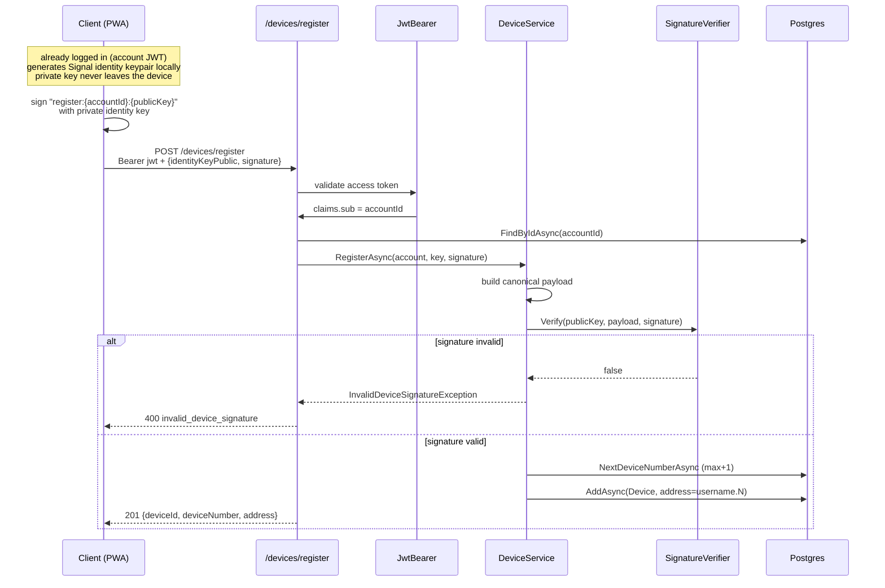
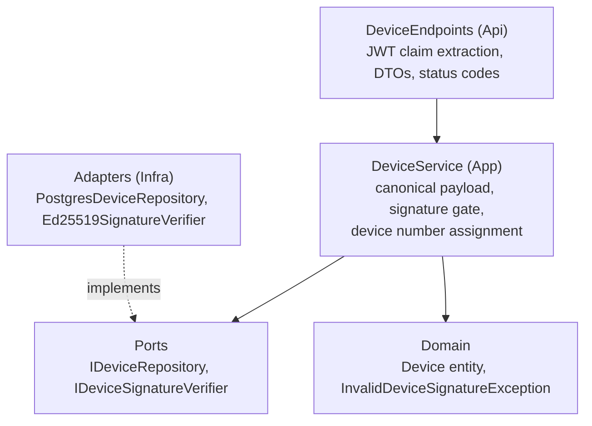

# Device binding — proof of key possession at registration

How a device gets bound to an account, per ADR 0007. This is the first of
two signature gates: registration (this document) and per-connection
authentication on the relay (the nonce challenge used by the WebSocket
flow).

## The invariant

> Nobody can bind a device to an account without holding the device's
> private identity key.

A stolen account JWT is not enough to inject a device: the attacker would
have to register a device whose key they control, which contacts see as a
brand-new identity (the TOFU warning from ADR 0006). The gate is
cryptographic, not permission-based.

## Addressing model

Every device of an account gets a routing address of the form
username.N, matching the wire fixtures (alice.1, bob.1):

```
carol (account)
├── carol.1  — laptop: own identity keypair, own mailbox
├── carol.2  — phone: own identity keypair, own mailbox
└── carol.3  — tablet (future)
```

Device numbers are scoped per account: the number answers which of Carol's
devices this is. A global counter would leak total system device count and
lose that meaning. The server assigns the number as MAX(device_number) + 1
at registration, and a UNIQUE (account_id, device_number) constraint is
the final guarantee against races.

Multi-device is first-class by design: each device has its own identity
keypair, its own WebSocket connection authenticated by its own key, its own
prekey bundle, and its own pending-envelope mailbox. End-to-end encryption
is device-to-device, not account-to-account — a sender encrypts once per
recipient device.

## Registration flow



## The canonical payload

The client signs a deterministic string that binds the signature to both
the account and the key:

```
register:{accountId}:{identityKeyPublic}
```

A captured signature cannot be replayed to bind the same key to a different
account — the payload would not match. Signing a static payload is
acceptable at registration because replay yields nothing useful; live
connections use a fresh server-issued nonce instead (the relay
authentication flow).

## Cryptography note

Signal identity keypairs are Curve25519; signatures use XEdDSA. The client
converts the public key to Ed25519 form before publishing, so the server
performs plain RFC 8032 Ed25519 verification (NSec.Cryptography). No
Curve25519 or XEdDSA machinery is needed server-side — the port only sees
a public key, a payload, and a signature.

## Layer map



## Where it connects

FindByAddressAsync exists for the next gate: when a WebSocket connects to
the relay, the server resolves the claimed address to its registered
identity key, issues a one-use nonce, and verifies the signature with the
same verifier port. Registration is the first act; per-connection
authentication is the second — both rest on the same proof of possession.
