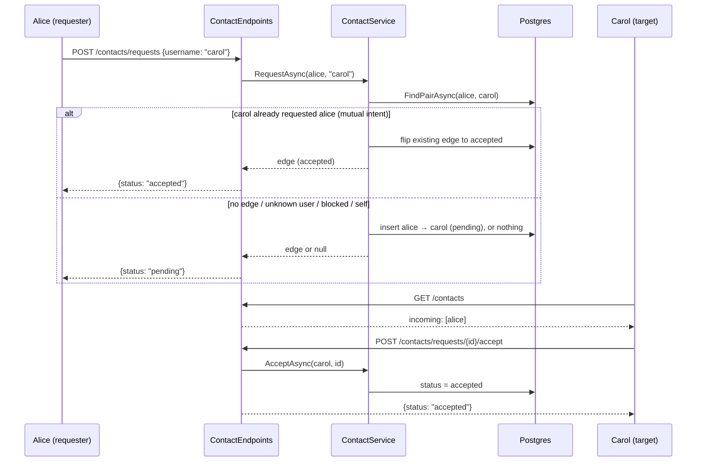

# Contacts — request, accept, block

How the contact graph works and why it exists, per ADR 0006 (revised
2026-09-21) and ADR 0007. This is the social layer: everything here runs
under the account JWT — no device signatures involved.

## The problem it solves

Prekey bundles must be fetchable to bootstrap an encrypted session, but a
fully public key directory (the Signal model) invites abuse:

- **Spam** — anyone who knows your address could open a session to you
- **Device enumeration** — probing carol.1, carol.2, ... reveals how many
  devices an account has registered
- **One-time-prekey drain** — fetching bundles in a loop burns the
  victim's one-time prekey pool, degrading forward secrecy for
  legitimate contacts

The contact graph is the authorization boundary for prekey fetch: the
directory answers only inside a relationship.

## The edge model

A ContactEdge is a directed arrow between two accounts:

```text
alice → carol   alice requested; carol decides      (pending)
alice → carol   they are contacts                   (accepted)
carol → alice   carol blocked alice                 (blocked)
```

Pending and blocked are directional — the arrow matters. Accepted grants
symmetric privileges. At most one pending/accepted edge exists per
account pair; blocked edges may coexist in both directions.

## Endpoints (account JWT)

| Endpoint | Effect |
| --- | --- |
| GET /contacts | lists contacts, incoming requests, outgoing requests |
| POST /contacts/requests {username} | creates a pending edge |
| POST /contacts/requests/{id}/accept | addressee accepts |
| DELETE /contacts/{id} | addressee declines, requester cancels, either party unfriends |
| POST /contacts/blocks {username} | wipes the pair's edges, plants a blocked edge |

## The request flow



## Design decisions

- **Anti-enumeration responses** — requesting an unknown, blocked, or
  self username returns the same {status: "pending"} shape as a real
  request, and no row is written. The endpoint cannot be used to probe
  which usernames exist.
- **Mutual intent auto-accepts** — if carol already has a pending edge
  toward alice, alice "requesting" carol is the acceptance; the existing
  edge flips to accepted. Otherwise two crossed pending edges would wait
  forever.
- **Block is silent and private** — it deletes every edge of the pair,
  plants a directed blocked edge, and the blocked party's future requests
  get the generic pending reply. Blocked edges never appear in lists.
- **The pending grant is one-directional** — while a request is pending,
  only the target may fetch the requester's prekey bundles, never the
  reverse. The person who accepted talks first.

## How this gates prekey fetch (1.6)

CanFetchPrekeysAsync(fetcher, owner) answers:

| Edge state | fetcher gets owner's bundle? |
| --- | --- |
| accepted, either direction | yes |
| pending, owner → fetcher | yes (target inspects requester) |
| pending, fetcher → owner | no |
| blocked, or no edge | no (403) |
| fetcher == owner | yes |

This is the mechanism that turns "knowing an address" into "knowing
nothing useful": without an edge, GET /prekeys/{address} is denied.

## What is NOT covered yet

- Request expiry — pending edges currently live until answered
- Rate limiting per source/target on request creation
- Profile/contact metadata (display names, avatars)
- The actual prekey endpoints that consume CanFetchPrekeysAsync (1.6)
