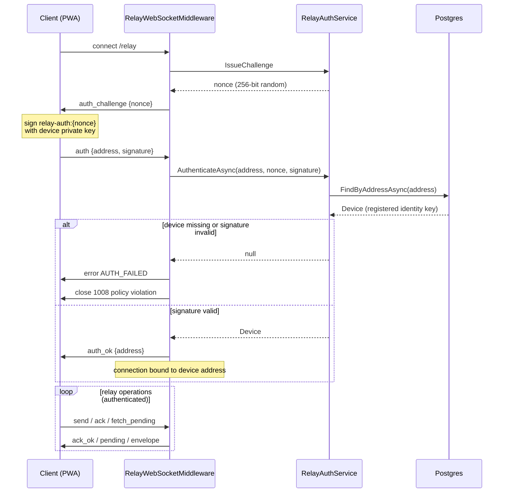
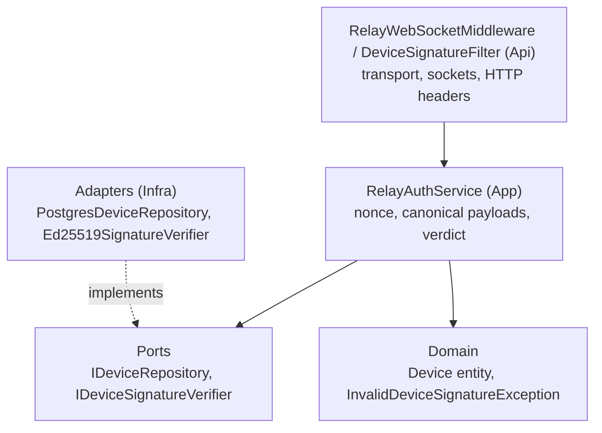

# Device-signature authentication — relay nonce challenge

How a WebSocket connection to the relay proves which device it belongs to,
per ADR 0007. This is the second of two signature gates; the first is the
registration proof covered in device-binding.md.

## The problem it solves

Before this gate existed, the /relay endpoint was fully open: any client
could connect and issue relay operations without any identity proof.
An open relay invites three attacks:

- **Mailbox deletion** — acknowledging someone else's envelope deletes it
  before the real recipient ever sees it (silent denial of service).
- **Send spoofing** — sending an envelope claiming a victim's
  senderAddress without being that device.
- **Mailbox draining** — fetching the pending ciphertext of any device.

The gate binds the connection to a registered device address by checking
proof of private-key possession, before any relay operation is allowed.

## Why not just the account JWT

The account JWT proves which account is calling; the relay needs to know
which device is connected. The JWT also travels with every login and lives
in client storage, so it is stealable; the device private key never crosses
the wire, so a signature against a fresh nonce proves live possession
without exposing anything.

## The challenge-response flow

## Design decisions

### One handshake per connection, not per message

The signature check authenticates the channel, not each frame. A WebSocket
is a stateful TCP session — once authenticated, every frame arrives over
that same secured channel. Signing again per message would only add
Ed25519 latency with no security gain.

### Fresh nonce per connection

IssueChallenge generates a new 256-bit random nonce per connection. A
captured signature is bound to the nonce it signed, so replaying it against
a different connection fails the verification.

### Domain separation of signatures

Every signing context uses its own canonical payload prefix so signatures
cannot be moved across contexts:

| Context | Canonical payload |
| --- | --- |
| Registration | register:{accountId}:{identityKeyPublic} |
| Relay auth | relay-auth:{nonce} |
| Signed REST | {method}:{path}:{timestamp}:{sha256(body-hex)} |

### 15-second handshake timeout

A connection that never answers the challenge is closed. Without the
timeout, an attacker could hold thousands of open sockets doing nothing —
a slowloris-style resource drain.

### Same error for every failure

Device not found, bad signature, timeout — all close with the same generic
AUTH_FAILED / AUTH_REQUIRED. Splitting them would tell an attacker whether
an address exists at all.

## What a packet capture actually yields

| Captured artifact | Can it impersonate the device? |
| --- | --- |
| A signature frame | No — cannot be inverted to the private key, and cannot be replayed because the next connection gets a different nonce |
| The public key | No — public keys only verify, they do not sign |
| The private key in device storage | Yes — but that requires compromising the device, not the network |

## REST equivalent

Sensitive REST endpoints (prekey upload in task 1.6) use
DeviceSignatureFilter instead of the WebSocket handshake because REST is
request-response — there is no channel to bind. The client sends three
headers on every signed request:

- X-Device-Address — the caller address
- X-Device-Timestamp — unix ms, checked within plus-minus 5 minutes
- X-Device-Signature — Ed25519 signature over the canonical payload above

The timestamp replaces the server-issued nonce: without it, a recorded
request could be replayed verbatim. The tolerance window accepts normal
clock skew.

## Layer map

## What remains for task 1.8

The handshake authenticates the connection, but the relay does not yet act
on that identity:

- Live push to the recipient when they are connected
- fetch_pending scoped to the authenticated device
- send validated against the authenticated senderAddress
- A connection registry mapping active addresses to sockets
