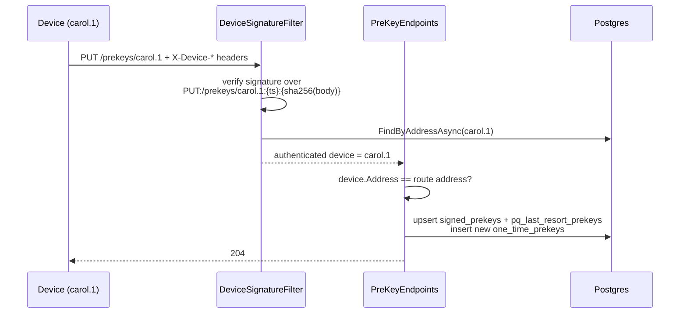
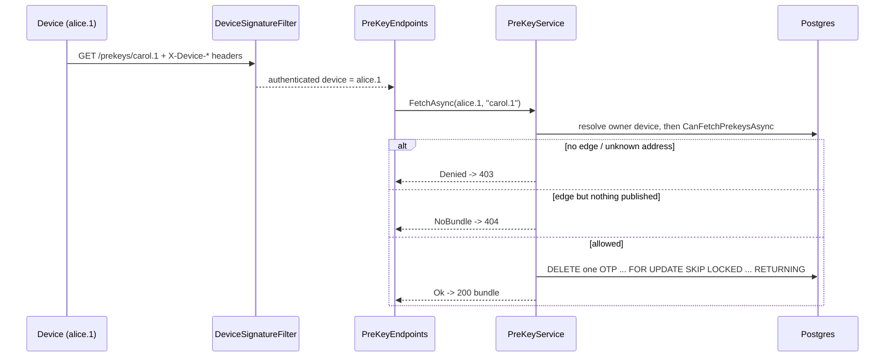

# Prekey directory — publish and contact-gated fetch

How prekey bundles are published and served, per ADR 0006 (revised
2026-09-21) and ADR 0007. This is the public-material half of X3DH: the
server stores and serves public keys only; private keys never leave the
device.

## The problem it solves

To start an encrypted session with someone who is offline, the initiator
needs that person's public material in advance. Each device pre-publishes
a bundle; contacts fetch it and run X3DH locally. The directory must
answer two hostile questions safely: who may publish under an address
(nobody but the device — MITM prevention) and who may fetch a bundle
(only contacts — enumeration and OTP-drain prevention).

## What a device publishes

| Material | Cardinality | Lifecycle |
| --- | --- | --- |
| Signed prekey | one current per device | rotated periodically; replaced on publish |
| One-time prekeys | pool (~100) | each fetch consumes one — never reused |
| PQ last-resort prekey | optional, one per device | served always, never consumed |
| Identity key | already registered (1.4) | returned in the bundle for convenience |

When the OTP pool is empty the bundle is still served with the signed
prekey alone — the session works, with slightly weaker forward secrecy.
The client should top up when the pool runs low.

## Endpoints

| Endpoint | Auth | Effect |
| --- | --- | --- |
| PUT /prekeys/{address} | device signature, address must match | upsert signed prekey (+ PQ), append OTP batch |
| GET /prekeys/{address} | device signature + contact edge | serve bundle, burn one OTP |

## The publish flow

A signature over a different address fails at the filter (401); a valid
signature under someone else's route address fails at the handler (403).
Either way, no one can inject a bundle under carol.1 without her key.

## The fetch flow

## Design decisions

- **403 for strangers AND unknown addresses** — the directory never
  confirms whether an address exists; probing yields nothing.
- **Atomic OTP claim** — the one-time prekey is removed by a single
  DELETE ... FOR UPDATE SKIP LOCKED ... RETURNING statement, so two
  concurrent fetches can never receive the same key.
- **The OTP is burned on fetch, not on use** — like Signal, the server
  cannot know whether the fetched bundle led to a real session, so the
  key is consumed eagerly.
- **The server does not verify the signed-prekey signature** — that
  signature is for the fetching client during X3DH, not for the relay.
  The upload channel is already authenticated by the device signature.
- **Body hashing needs early buffering** — model binding consumes the
  request stream before endpoint filters run, so Program.cs enables
  buffering at pipeline start and the filter rewinds before hashing.

## What is NOT covered yet

- OTP pool exhaustion signalling (client polls OneTimeCount implicitly
  via republish cadence)
- Signed-prekey rotation schedule enforcement
- The X3DH session bootstrap itself — client-side, phase 2
