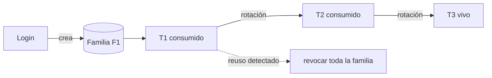
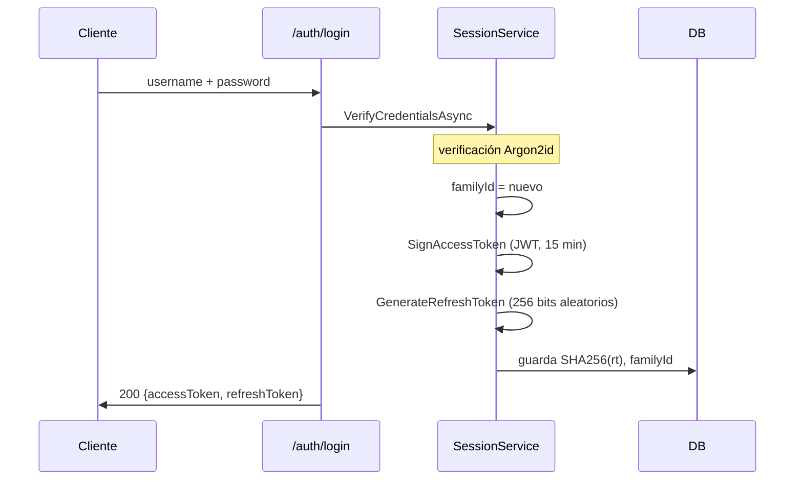
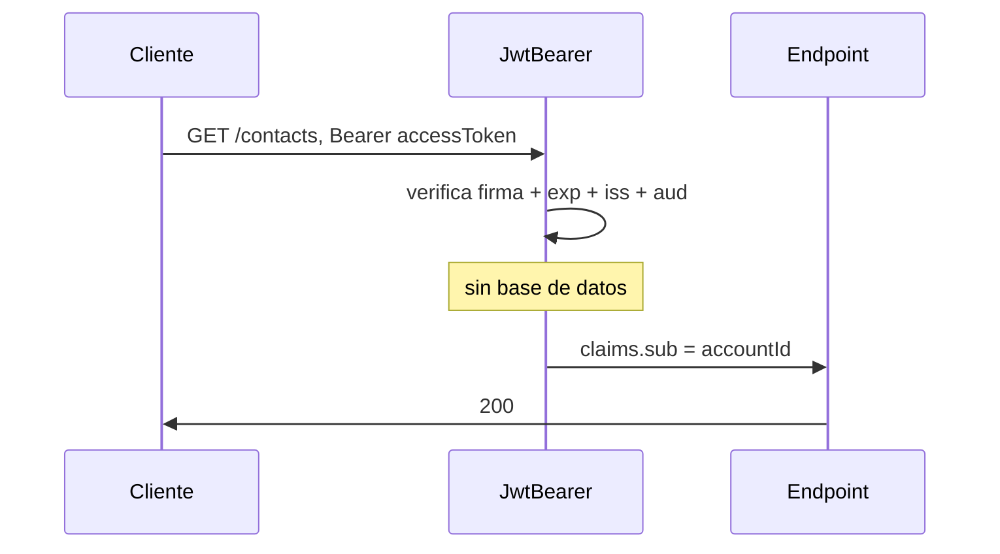
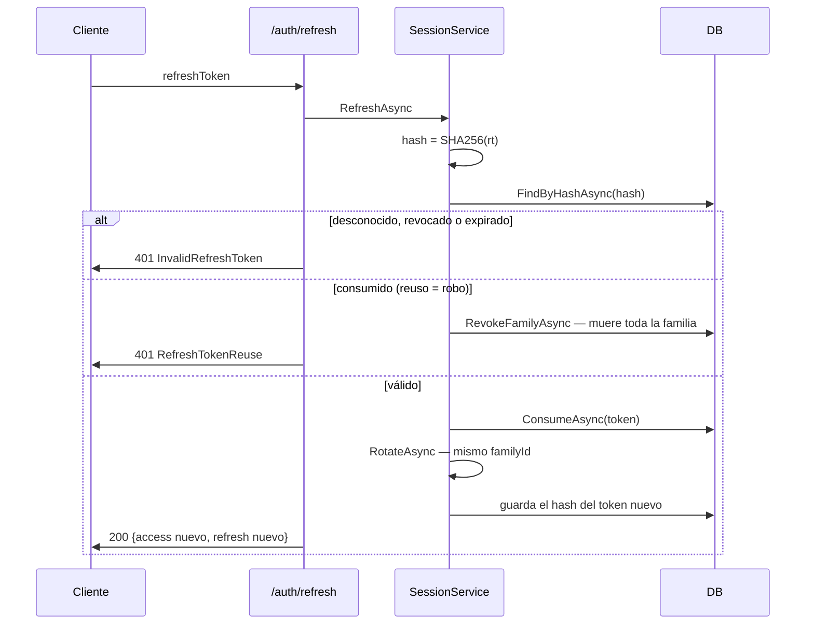
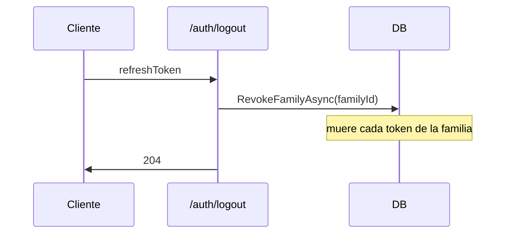
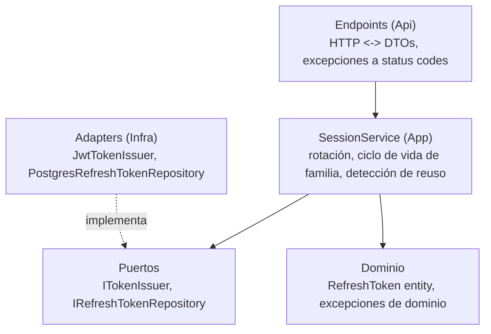

# Flujo de sesión de cuenta — JWT + rotación de refresh token

Explica mecánicamente cómo funcionan las sesiones de cuenta, según la
estrategia del ADR 0007. Este documento es la guía del lector al código;
el ADR es el registro de la decisión.

## Por qué dos tokens

La auth de cuenta separa dos inquietudes:

- **Acceso** — JWT corto (~15 min), scope de cuenta. Sin estado: el
  servidor valida la firma sin tocar la base de datos. Se usa en cada
  request de endpoints sociales.
- **Permanencia** — refresh token opaco (~30 días), con estado. El
  servidor lo consulta en la base de datos en cada uso, así puede ser
  consumido, rotado y revocado. Se usa solo en el endpoint de refresh.

Sin esta división, las alternativas son ambas malas: un JWT de 15 minutos
solo obliga a poner la contraseña cada cuarto de hora; un JWT de 30 días
no se puede revocar — una copia robada sigue válida hasta expirar.

## Por qué el refresh token es opaco, no JWT

La revocación y la rotación requieren estado en el servidor — la base de
datos debe saber si un token fue consumido o revocado. Si el servidor de
todas formas tiene que consultar la base, un JWT firmado añade una firma
que nunca se usa. Un string aleatorio opaco es más simple y más seguro:

- Sin metadata legible — un JWT decodificado expone subject y expiración;
  un string opaco no revela nada.
- Sin material de firma que mantener o rotar.
- Inadivinable e infalsificable — el único valor válido es el que el
  servidor emitió.

Regla de dedo: JWT cuando se quiere validación sin estado; opaco cuando se
necesita revocabilidad. El access token no necesita revocación (expira en
15 minutos) así que es JWT; el refresh debe ser revocable (rotación,
detección de reuso, logout) así que es opaco.

## Por qué el refresh token se guarda hasheado

La base de datos guarda el hash SHA-256 del token, nunca el token. Un leak
de la base solo expone hashes — inutilizables para requests de refresh. El
servidor no descifra el valor guardado; hashea el token entrante y compara
hashes. SHA-256 es determinista: mismo input, mismo output.

SHA-256 (y no Argon2id) porque el input ya son 256 bits de aleatoriedad
criptográfica — no hay diccionario que defender. El hash existe solo para
sobrevivir a un leak de la base.

## Rotación y familias

Cada uso de refresh consume el token presentado y emite uno nuevo dentro
de la misma familia. Una familia es todos los tokens descendidos de un
login:

La granularidad de revocación es la familia, no el token. Si un token
consumido se presenta otra vez, se revoca la familia entera — no solo ese
token — porque quien lo presenta podría tener varios tokens del mismo
linaje. La familia es la frontera de confianza: si cualquier token en ella
muestra reuso, ningún token en ella es confiable nunca más.

## Semántica de detección de robo

Quien presenta un token primero gana el siguiente par; el intento del otro
presenta un token consumido, lo que mata la familia:

- El atacante re-fresca primero → el atacante obtiene el par nuevo → el
  siguiente refresh del usuario presenta un token consumido → reuso
  detectado → familia revocada → el atacante también pierde la sesión.
- El usuario re-fresca primero → el usuario sigue → el reuso del
  atacante → familia revocada.

El único triunfo temporal del atacante es re-frescar mientras el usuario
nunca regresa. En cuanto el usuario vuelve, la familia muere. Es
fail-closed: ante la duda, nadie se queda dentro — el usuario se
re-autentica con la contraseña, que el atacante no tiene.

La propiedad de seguridad no es "gana el usuario legítimo"; es "el robo
siempre se detecta y mata la sesión para ambas partes".

## Flujos de request

### Login — crea una familia

### Request normal — validación JWT sin estado

### Refresh — rotación y detección de robo

### Logout — mata la familia entera

## Mapa de capas

## Análisis del peor caso

| Artefacto robado | Daño |
| --- | --- |
| Access token | 15 minutos de endpoints sociales; nunca el buzón |
| Refresh token | La familia muere en la primera carrera; atacante detectado y expulsado |
| Contraseña + refresh | Igual que arriba; cambiar contraseña cierra la línea |
| Dump de la base | Hashes de contraseñas (Argon2id) + hashes de tokens (SHA-256) — sin secretos utilizables |
| Clave de firma | Access tokens forjados por 15 minutos; el refresh sigue imposible — la rotación necesita el valor opaco en la DB |
