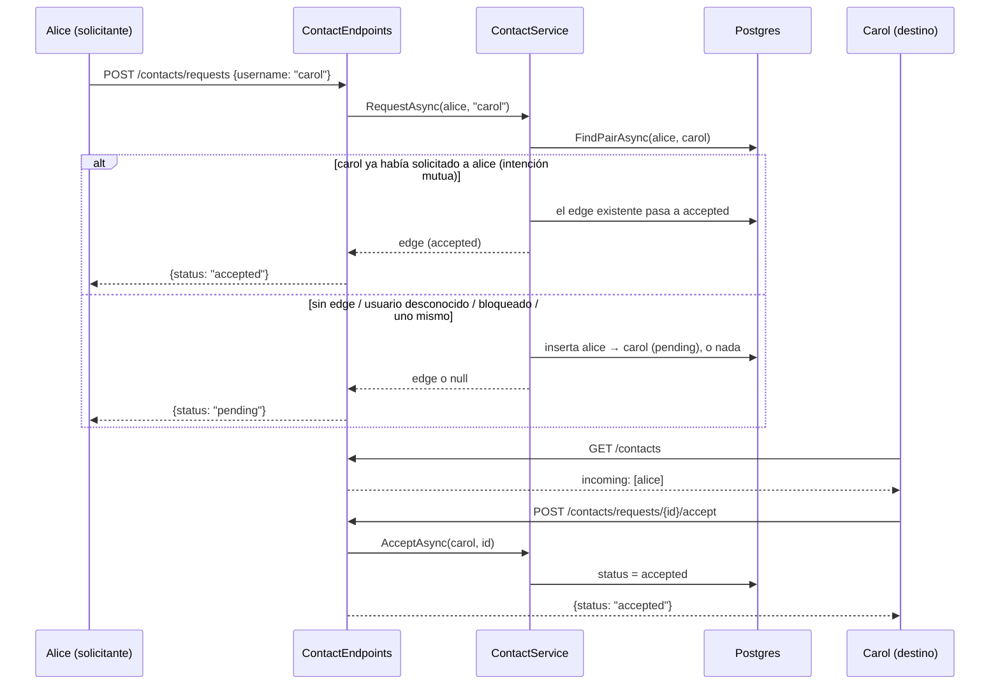

# Contactos — solicitud, aceptación, bloqueo

Cómo funciona el grafo de contactos y por qué existe, según ADR 0006
(revisado 2026-09-21) y ADR 0007. Esta es la capa social: todo aquí corre
bajo el JWT de cuenta — no hay firmas de dispositivo involucradas.

## El problema que resuelve

Los prekey bundles deben poder descargarse para iniciar una sesión
cifrada, pero un directorio de claves totalmente público (el modelo de
Signal) invita al abuso:

- **Spam** — cualquiera que conozca tu address podría abrir una sesión
  hacia ti
- **Enumeración de dispositivos** — sondear carol.1, carol.2, ... revela
  cuántos dispositivos tiene registrados una cuenta
- **Drenado de one-time prekeys** — descargar bundles en bucle quema el
  pool de prekeys de un solo uso de la víctima, degradando el forward
  secrecy de sus contactos legítimos

El grafo de contactos es la frontera de autorización para el fetch de
prekeys: el directorio solo responde dentro de una relación.

## El modelo de edges

Un ContactEdge es una flecha dirigida entre dos cuentas:

```text
alice → carol   alice pidió; carol decide            (pending)
alice → carol   son contactos                        (accepted)
carol → alice   carol bloqueó a alice                (blocked)
```

Pending y blocked son direccionales — la flecha importa. Accepted otorga
privilegios simétricos. A lo sumo existe un edge pending/accepted por
par de cuentas; los edges blocked pueden coexistir en ambas direcciones.

## Endpoints (JWT de cuenta)

| Endpoint | Efecto |
| --- | --- |
| GET /contacts | lista contactos, solicitudes entrantes y salientes |
| POST /contacts/requests {username} | crea un edge pending |
| POST /contacts/requests/{id}/accept | el destinatario acepta |
| DELETE /contacts/{id} | el destinatario rechaza, el emisor cancela, cualquiera elimina el contacto |
| POST /contacts/blocks {username} | borra los edges del par y planta un edge blocked |

## El flujo de solicitud



## Decisiones de diseño

- **Respuestas anti-enumeración** — solicitar un username desconocido,
  bloqueado o el propio devuelve la misma forma {status: "pending"} que
  una solicitud real, y no se escribe ninguna fila. El endpoint no puede
  usarse para sondear qué usernames existen.
- **La intención mutua auto-acepta** — si carol ya tiene un edge pending
  hacia alice, que alice "solicite" a carol ES la aceptación; el edge
  existente pasa a accepted. Sin esto, dos edges pending cruzados
  esperarían para siempre.
- **El bloqueo es silencioso y privado** — borra todos los edges del par,
  planta un edge blocked dirigido, y las futuras solicitudes del
  bloqueado reciben la respuesta genérica pending. Los edges blocked
  nunca aparecen en las listas.
- **El permiso pending es unidireccional** — mientras una solicitud está
  pendiente, solo el destino puede descargar los bundles del solicitante,
  nunca al revés. Quien acepta habla primero.

## Cómo esto controla el fetch de prekeys (1.6)

CanFetchPrekeysAsync(fetcher, owner) responde:

| Estado del edge | ¿fetcher obtiene el bundle de owner? |
| --- | --- |
| accepted, cualquier dirección | sí |
| pending, owner → fetcher | sí (el destino inspecciona al solicitante) |
| pending, fetcher → owner | no |
| blocked, o sin edge | no (403) |
| fetcher == owner | sí |

Este es el mecanismo que convierte "conocer un address" en "no saber
nada útil": sin un edge, GET /prekeys/{address} es denegado.

## Lo que NO está cubierto aún

- Expiración de solicitudes — los edges pending viven hasta ser
  respondidos
- Rate limiting por origen/destino en la creación de solicitudes
- Metadata de perfil/contactos (nombres visibles, avatares)
