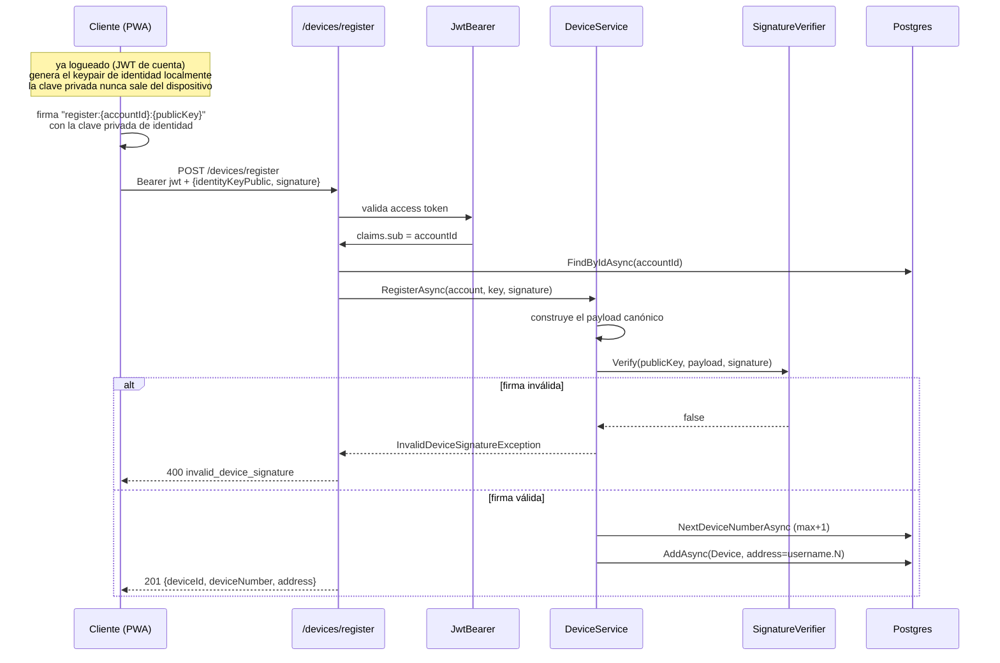
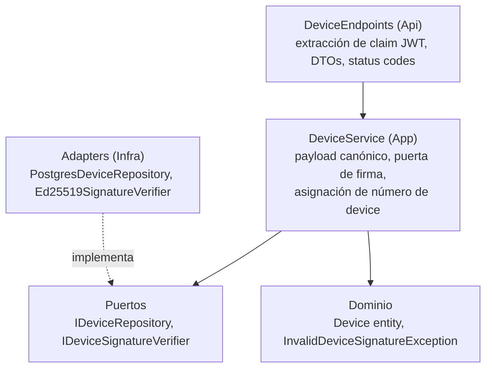

# Vinculación de dispositivo — prueba de posesión de clave en el registro

Cómo un dispositivo queda ligado a una cuenta, según ADR 0007. Es la
primera de dos puertas de firma: registro (este documento) y autenticación
por conexión en el relay (el challenge de nonce que usa el flujo WebSocket).

## La invariante

> Nadie puede ligar un dispositivo a una cuenta sin poseer la clave privada
> de identidad del dispositivo.

Un JWT de cuenta robado no basta para inyectar un dispositivo: el atacante
tendría que registrar un dispositivo cuya clave él controle, que los
contactos ven como una identidad completamente nueva (el aviso TOFU del
ADR 0006). La puerta es criptográfica, no basada en permisos.

## Modelo de direccionamiento

Cada dispositivo de una cuenta recibe una address de ruteo de la forma
username.N, igual que las fixtures del wire (alice.1, bob.1):

```
carol (cuenta)
├── carol.1  — laptop: su propio keypair de identidad, su propio buzón
├── carol.2  — celular: su propio keypair de identidad, su propio buzón
└── carol.3  — tablet (futuro)
```

Los números de dispositivo se contabilizan por cuenta: el número responde
cuál de los dispositivos de Carol es. Un contador global filtraría el
conteo total de dispositivos del sistema y perdería ese significado. El
server asigna el número como MAX(device_number) + 1 en el registro, y una
constraint UNIQUE (account_id, device_number) es la garantía final contra
carreras.

Multi-dispositivo es de primera clase por diseño: cada dispositivo tiene
su propio keypair de identidad, su propia conexión WebSocket autenticada
con su propia clave, su propio bundle de prekeys y su propio buzón de
envelopes pendientes. El cifrado extremo a extremo es de dispositivo a
dispositivo, no de cuenta a cuenta — el emisor cifra una vez por
dispositivo destinatario.

## Flujo de registro



## El payload canónico

El cliente firma un string determinista que ata la firma tanto a la cuenta
como a la clave:

```
register:{accountId}:{identityKeyPublic}
```

Una firma capturada no se puede reenviar para ligar la misma clave a otra
cuenta — el payload no coincidiría. Firmar un payload estático es
aceptable en el registro porque el replay no produce nada útil; las
conexiones vivas usan un nonce fresco emitido por el server (el flujo de
autenticación del relay).

## Nota criptográfica

Los keypairs de identidad de Signal son Curve25519; las firmas usan
XEdDSA. El cliente convierte la clave pública a forma Ed25519 antes de
publicarla, así que el server ejecuta verificación Ed25519 plana (RFC
8032, vía NSec.Cryptography). No se necesita maquinaria Curve25519 ni
XEdDSA en el server — el puerto solo ve una clave pública, un payload y
una firma.

## Mapa de capas



## Dónde conecta

FindByAddressAsync existe para la segunda puerta: cuando un WebSocket
conecta al relay, el server resuelve la address declarada a su clave de
identidad registrada, emite un nonce de un solo uso y verifica la firma
con el mismo puerto verificador. El registro es el primer acto; la
autenticación por conexión es el segundo — ambos descansan sobre la misma
prueba de posesión.
