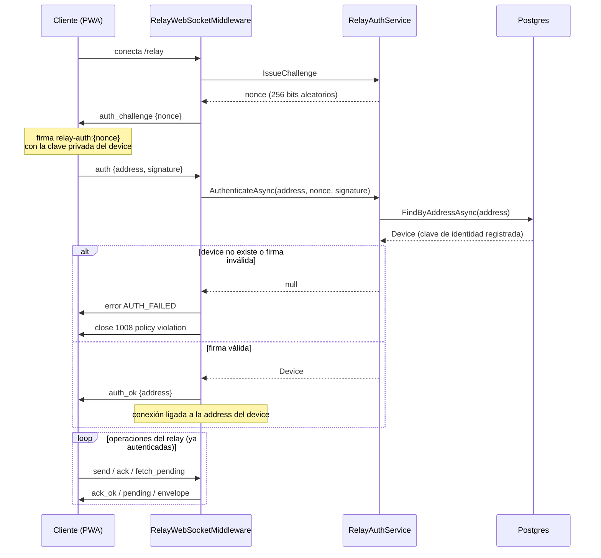
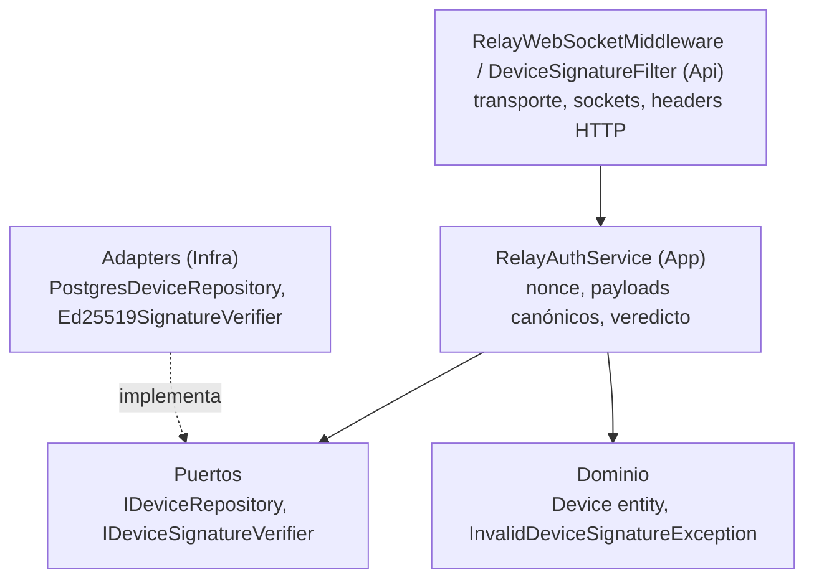

# Autenticación por firma de dispositivo — challenge de nonce en el relay

Cómo una conexión WebSocket al relay demuestra a qué dispositivo pertenece,
según ADR 0007. Es la segunda de dos puertas de firma; la primera es la
prueba de registro cubierta en device-binding.md.

## El problema que resuelve

Antes de esta puerta, el endpoint /relay era completamente abierto:
cualquier cliente podía conectarse y ejecutar operaciones del relay sin
ninguna prueba de identidad. Un relay abierto invita a tres ataques:

- **Borrado de buzón** — confirmar (ack) el envelope de otro lo elimina
  antes de que el destinatario real lo vea (denegación de servicio
  silenciosa).
- **Suplantación de emisor** — enviar un envelope declarando el
  senderAddress de una víctima sin ser ese dispositivo.
- **Drenado de buzón** — bajar el ciphertext pendiente de cualquier
  dispositivo.

La puerta liga la conexión a una address de dispositivo registrada
verificando la posesión de la clave privada, antes de permitir cualquier
operación del relay.

## Por qué no basta el JWT de cuenta

El JWT de cuenta prueba qué cuenta llama; el relay necesita saber qué
dispositivo está conectado. Además, el JWT viaja en cada login y vive en
el almacenamiento del cliente, así que es robable; la clave privada del
dispositivo nunca cruza la red, así que firmar un nonce fresco prueba
posesión viva sin exponer nada.

## El flujo challenge-response

## Decisiones de diseño

### Un handshake por conexión, no por mensaje

La firma autentica el canal, no cada frame. Un WebSocket es una sesión TCP
con estado — una vez autenticado, todo frame llega por ese canal asegurado.
Firmar cada mensaje solo añadiría latencia de Ed25519 sin ganancia de
seguridad.

### Nonce fresco por conexión

IssueChallenge genera un nonce aleatorio de 256 bits por conexión. Una
firma capturada está atada al nonce que firmó, así que reenviarla en otra
conexión falla la verificación.

### Separación de dominio de las firmas

Cada contexto de firma usa su propio prefijo en el payload canónico para
que las firmas no puedan moverse de un contexto a otro:

| Contexto | Payload canónico |
| --- | --- |
| Registro | register:{accountId}:{identityKeyPublic} |
| Auth del relay | relay-auth:{nonce} |
| REST firmado | {method}:{path}:{timestamp}:{sha256(body-hex)} |

### Timeout de 15 segundos en el handshake

Una conexión que nunca responde el challenge se cierra. Sin el timeout, un
atacante podría sostener miles de sockets abiertos sin hacer nada — un
drenaje de recursos estilo slowloris.

### Mismo error para todo fallo

Device inexistente, firma mala, timeout — todo cierra con el mismo
AUTH_FAILED / AUTH_REQUIRED genérico. Distinguir le diría al atacante si
una address existe en primer lugar.

## Qué obtiene realmente quien capture paquetes

| Artefacto capturado | ¿Puede suplantar al device? |
| --- | --- |
| Un frame de firma | No — no se puede invertir hasta la clave privada, y no se puede reenviar porque la siguiente conexión usa un nonce distinto |
| La clave pública | No — las claves públicas solo verifican, no firman |
| La clave privada en el almacenamiento del dispositivo | Sí — pero eso requiere comprometer el dispositivo, no la red |

## El equivalente en REST

Los endpoints REST sensibles (subida de prekeys en la tarea 1.6) usan
DeviceSignatureFilter en vez del handshake de WebSocket, porque REST es
request-response — no hay un canal que ligar. El cliente envía tres
headers en cada request firmada:

- X-Device-Address — la address del que llama
- X-Device-Timestamp — unix ms, verificado dentro de más-menos 5 minutos
- X-Device-Signature — firma Ed25519 sobre el payload canónico de arriba

El timestamp reemplaza al nonce emitido por el server: sin él, una request
grabada podría reenviarse textualmente. La ventana de tolerancia acepta el
desfase normal de relojes.

## Mapa de capas

## Lo que queda para la tarea 1.8

El handshake autentica la conexión, pero el relay aún no actúa sobre esa
identidad:

- Push en vivo al destinatario cuando está conectado
- fetch_pending acotado al device autenticado
- send validado contra el senderAddress autenticado
- Un registro de conexiones que mapee addresses activas a sockets
