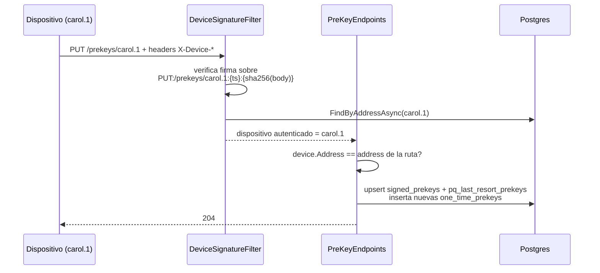
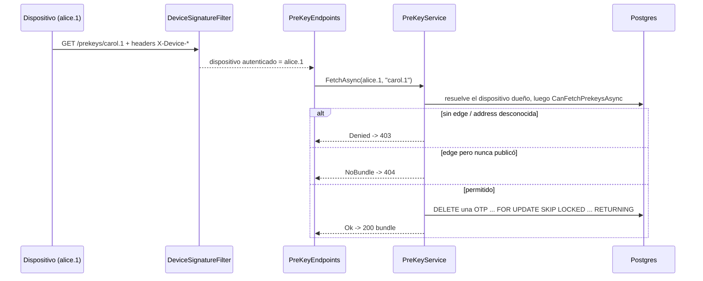

# Directorio de prekeys — publicación y fetch con control de contactos

Cómo se publican y sirven los prekey bundles, según ADR 0006 (revisado
2026-09-21) y ADR 0007. Esta es la mitad pública de X3DH: el servidor
solo guarda y sirve claves públicas; las privadas nunca salen del
dispositivo.

## El problema que resuelve

Para iniciar una sesión cifrada con alguien que está offline, el
iniciador necesita el material público de esa persona por adelantado.
Cada dispositivo pre-publica un bundle; los contactos lo descargan y
ejecutan X3DH localmente. El directorio debe responder dos preguntas
hostiles de forma segura: quién puede publicar bajo una address (nadie
más que el dispositivo — prevención de MITM) y quién puede descargar un
bundle (solo contactos — prevención de enumeración y drenado de OTPs).

## Qué publica un dispositivo

| Material | Cardinalidad | Ciclo de vida |
| --- | --- | --- |
| Signed prekey | una vigente por dispositivo | se rota periódicamente; se reemplaza al publicar |
| One-time prekeys | pool (~100) | cada fetch consume una — nunca se reutilizan |
| PQ last-resort prekey | opcional, una por dispositivo | siempre se sirve, nunca se consume |
| Identity key | ya registrada (1.4) | se devuelve en el bundle por conveniencia |

Cuando el pool de OTPs se vacía, el bundle se sigue sirviendo solo con
la signed prekey — la sesión funciona, con forward secrecy levemente más
débil. El cliente debería re-abastecer el pool cuando esté bajo.

## Endpoints

| Endpoint | Auth | Efecto |
| --- | --- | --- |
| PUT /prekeys/{address} | firma de dispositivo, la address debe coincidir | upsert de signed prekey (+ PQ), agrega lote de OTPs |
| GET /prekeys/{address} | firma de dispositivo + edge de contacto | sirve el bundle, quema una OTP |

## El flujo de publicación

Una firma de una address distinta falla en el filtro (401); una firma
válida bajo la address ajena de la ruta falla en el handler (403). De
cualquier forma, nadie puede inyectar un bundle bajo carol.1 sin su
clave.

## El flujo de descarga

## Decisiones de diseño

- **403 para extraños Y addresses desconocidas** — el directorio nunca
  confirma si una address existe; sondear no produce nada.
- **Claim atómico de OTP** — la one-time prekey se elimina con una sola
  sentencia DELETE ... FOR UPDATE SKIP LOCKED ... RETURNING, así dos
  fetches concurrentes nunca pueden recibir la misma clave.
- **La OTP se quema al descargar, no al usar** — como Signal, el servidor
  no puede saber si el bundle descargado derivó en una sesión real, así
  que la clave se consume de inmediato.
- **El servidor no verifica la firma de la signed prekey** — esa firma es
  para el cliente que descarga durante X3DH, no para el relay. El canal
  de publicación ya está autenticado por la firma del dispositivo.
- **El hash del body necesita buffering temprano** — el model binding
  consume el stream del request antes de que corran los endpoint
  filters, así que Program.cs habilita buffering al inicio del pipeline
  y el filtro rebobina antes de hashear.

## Lo que NO está cubierto aún

- Señalización de pool OTP bajo (el cliente consulta OneTimeCount
  implícitamente vía la cadencia de republicación)
- Enforzamiento del calendario de rotación de signed prekey
- El bootstrap de sesión X3DH en sí — del lado del cliente, fase 2
